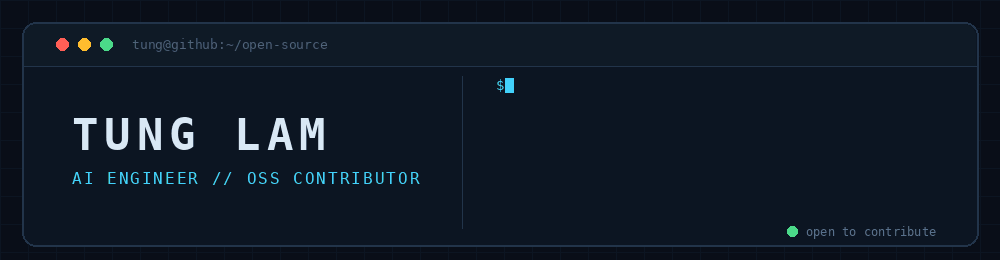
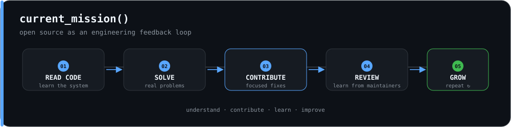
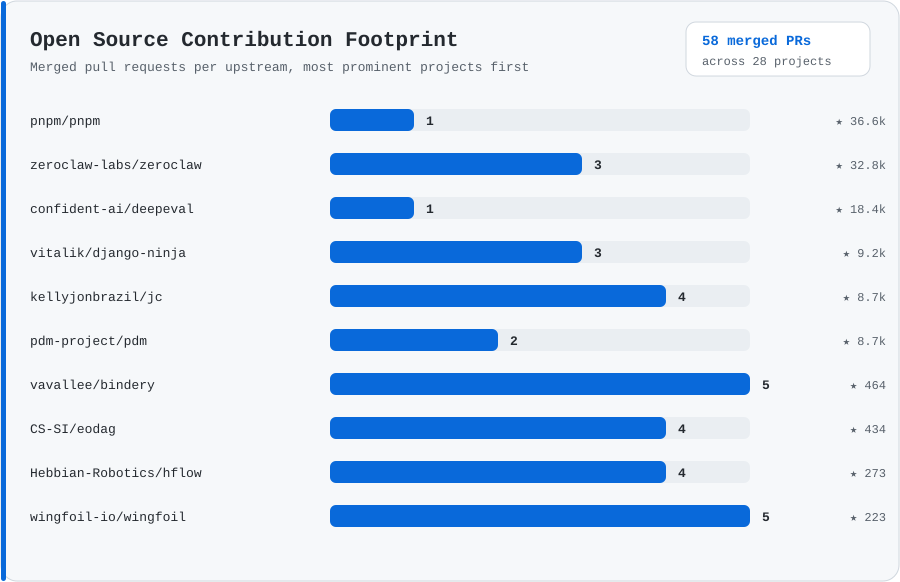
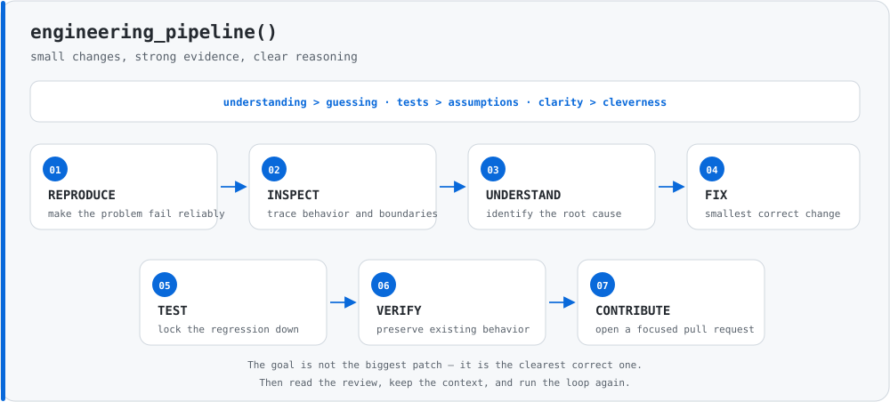
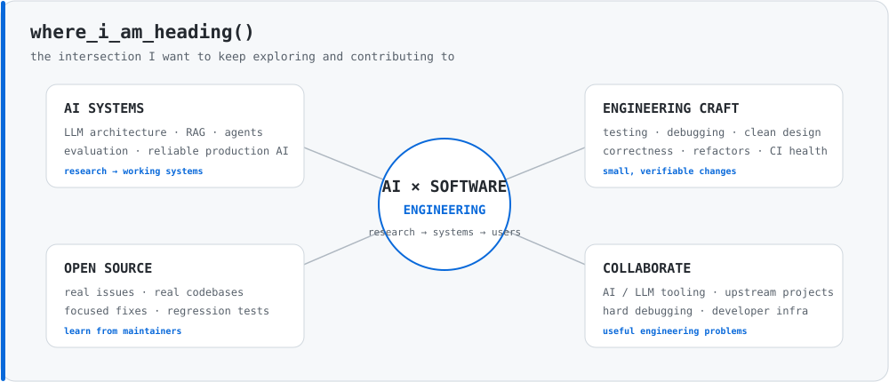

 

  

**AI Engineer · Python · LLM Systems · Open Source Contributor**

---

## `> whoami`

I'm an **AI Engineer** who enjoys understanding how systems behave beneath the abstraction layer.

My interests sit around **LLM systems, Python, backend engineering, and production AI**. I like reading unfamiliar codebases, reproducing real bugs, tracing them to their root cause, and turning that understanding into **small, focused, well-tested fixes**.

Right now, I'm intentionally spending more time contributing to the **open-source Python ecosystem**.

---

## Open Source Mode

> [!NOTE]
> I'm currently focusing on real issues in established Python projects: bug fixes, regressions, edge cases, tests, and framework internals.

<table>
<tr>
<td width="50%" valign="top">

### `debug`

- Reproducing tricky bugs
- Root-cause analysis
- Edge cases and regressions
- Understanding framework internals

</td>
<td width="50%" valign="top">

### `fix`

- Small, maintainable changes
- Regression coverage
- Preserving existing behavior
- Clear validation before submitting

</td>
</tr>
</table>

---

## Open Source Contribution Footprint

Generated from my public upstream pull requests and refreshed automatically.

---

## Latest Open-Source Pull Requests

<!-- OSS-PRS:START -->
- **[sxzz/ast-explorer](https://github.com/sxzz/ast-explorer)** — [#295 fix: remember parser options](https://github.com/sxzz/ast-explorer/pull/295) · [open]
- **[LeyckerS/moondownloader](https://github.com/LeyckerS/moondownloader)** — [#176 ci: check web JavaScript syntax](https://github.com/LeyckerS/moondownloader/pull/176) · [merged]
- **[wingfoil-io/wingfoil](https://github.com/wingfoil-io/wingfoil)** — [#924 ci(pypi): restore release attestations](https://github.com/wingfoil-io/wingfoil/pull/924) · [open]
- **[nominal-io/instro](https://github.com/nominal-io/instro)** — [#432 feat(awg): use bulk download for small LAN waveforms](https://github.com/nominal-io/instro/pull/432) · [merged]
- **[SebastienMelki/sebuf](https://github.com/SebastienMelki/sebuf)** — [#257 fix(clientgen): handle optional query parameters](https://github.com/SebastienMelki/sebuf/pull/257) · [open]
<!-- OSS-PRS:END -->

This section is kept up to date automatically by GitHub Actions.

---

## Engineering Focus

<table>
<tr>
<td width="50%" valign="top">

### `AI systems`

- Large Language Models
- Retrieval-Augmented Generation
- Agentic AI
- LLM evaluation
- AI system architecture
- Production AI reliability

</td>
<td width="50%" valign="top">

### `software engineering`

- Python ecosystem
- Backend frameworks
- API design
- Testing & debugging
- Distributed systems
- Open-source development

</td>
</tr>
</table>

---

## Toolbox

### `AI / LLM`

### `Python / Backend`

### `Systems`

---

## How I Solve Problems

---

## Where I'm Heading

---

### `understand → fix → test → contribute`

**Build things. Break assumptions. Fix the root cause. Contribute back.**

 

  

AI Engineering · LLM Systems · Python · Open Source

