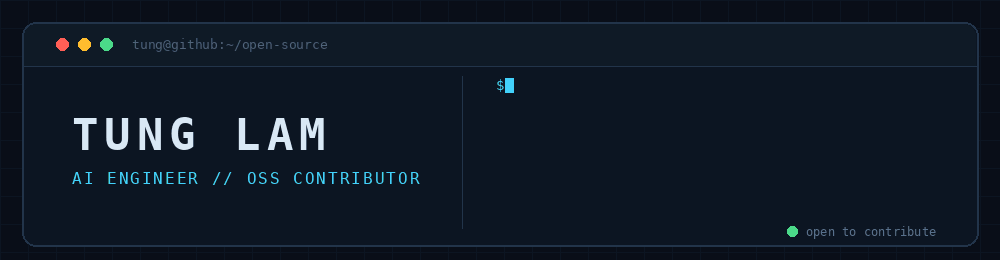
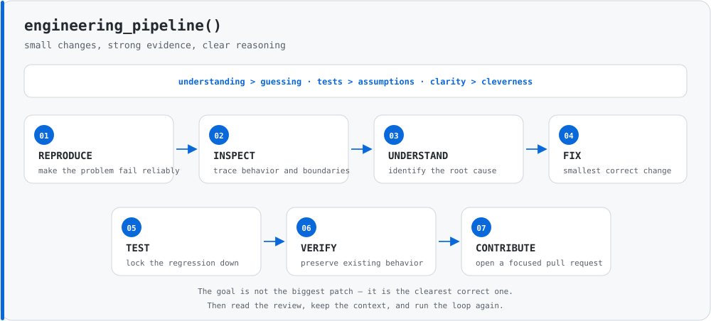

 

  

**AI Engineer · LLM Systems · Developer Tooling**

---

## `> whoami`

I'm Tung, an **AI Engineer** interested in how systems behave beneath the abstraction layer.

I work on LLM workflows and the backend systems around them. I enjoy reading unfamiliar codebases, tracing unexpected behavior to its root cause, and making changes that are easy to understand and maintain.

Open source is one way I explore those interests, learn from other engineers, and contribute fixes upstream.

## What I Work On

| Area | Focus |
| :--- | :--- |
| **LLM systems** | Retrieval, agent workflows, and evaluation |
| **Backend engineering** | APIs, integrations, and runtime behavior |
| **Developer tooling** | Testing, debugging, and package management |

---

## Selected Contributions

A few problems I've worked through in open-source projects:

| Project | Change |
| :--- | :--- |
| **[pnpm](https://github.com/pnpm/pnpm/pull/16416)** | Added dependency validation to the Rust CLI so installs report malformed specifiers instead of silently skipping them. |
| **[Django Ninja](https://github.com/vitalik/django-ninja/pull/1755)** | Fixed async authentication callbacks running twice on synchronous endpoints. |
| **[jc](https://github.com/kellyjonbrazil/jc/pull/753)** | Fixed an HTTP header parser crash on whitespace-only lines. |
| **[versitygw](https://github.com/versity/versitygw/pull/2399)** | Aligned Object Lock XML responses with AWS S3 when no default retention is configured. |

I've written up the debugging process behind several of these in **[oss-case-studies](https://github.com/tunglambk/oss-case-studies)**.

---

## Toolbox

### `AI / LLM`

### `Systems`

---

## How I Solve Problems

---

Contribution history

<!-- OSS-NOTABLE:START -->
111 merged pull requests across 32 upstream repositories (all-time).
<!-- OSS-NOTABLE:END -->

[Browse contributions](https://github.com/pulls?q=is%3Apr+author%3Atunglambk+is%3Amerged+-user%3Atunglambk) · Counts refreshed automatically from GitHub.

 

Interested in LLM systems, developer tooling, or a tricky bug? [Let's talk](mailto:lamphambatung96@gmail.com).
